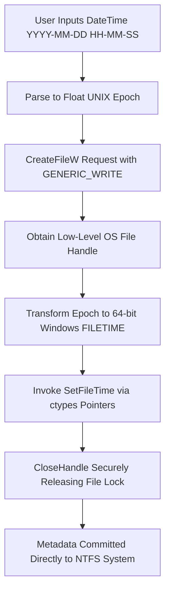

# WinFile-Timestamp-Editor

📥 **Download Setup:** [WinFile-Timestamp-Editor v1.1.0](https://github.com/InukaWijerathna/WinFile-Timestamp-Editor/releases/download/v1.1.0/winfile-timestamp-editor-v1.1.0.exe)

A premium, lightweight, and native Windows desktop utility designed for system administrators, digital forensics research, automated build-system verification, and data caching testing. This tool allows users to view, modify, and completely forge low-level file system metadata properties—specifically **Creation Date (Birthtime)**, **Last Modified Date**, and **Last Accessed Date**—through a highly responsive and polished graphical user interface.

Unlike high-level runtime libraries that restrict access to system attributes, this application bypasses standard framework layers by binding directly to the Windows OS kernel via the Win32 API.

---

## 🚀 Key Technical Capabilities

* **Zero External Dependencies:** Built entirely with native Python libraries. No bulky external GUI dependencies (like PyQt, PySide, or WXPython) required—starts up instantly.
* **Direct NTFS Kernel Manipulation:** Interfaces straight with low-level OS file handles to modify birth/creation times that are typically write-protected in standard user-space environments.
* **Sequential DateTime Chaining:** Standardizes date/time entries with a unified `📅 Edit...` button that guides users step-by-step through calendar date and hour-minute-second configuration.
* **Batch Range Randomization:** Allows bulk importing of multiple target files and applies precise timestamps or generates randomized timestamps within a user-defined starting and ending window.
* **Active Window Centering:** Automatically calculates geometry on the fly to center the native date/time pickers directly over the main window, preventing coordinate drift on high-DPI or multi-monitor setups.
* **Process-Level Taskbar Integration:** Sets a process-level AppUserModelID to force Windows Explorer to bind the launcher and taskbar groups directly to the premium `logo.ico` asset.

---

## 🛠️ Technical Architecture & Core Principles

Standard programming runtimes (such as Python's standard `os.utime()`) only permit modifications to the *Accessed* (`atime`) and *Modified* (`mtime`) parameters of a file. Modifying the **Creation Time** requires calling deep system libraries inside the Windows kernel.

This utility leverages Python's built-in Foreign Function Interface (`ctypes`) to load `kernel32.dll` and map native memory structures:



### The Low-Level System Pipeline

1. **File Descriptor Authorization:** The tool requests low-level write access to the physical file using the `CreateFileW` system call with `GENERIC_WRITE` (`0x40000000`) authorization flags, opening a direct system pipe to the NTFS/FAT32 driver.
2. **Epoch-to-FILETIME Translation:** UNIX epoch values (fractions of seconds since January 1, 1970) are transformed into Windows `FILETIME` structures (representing 100-nanosecond intervals since January 1, 1601) using byte-shifting and translation offset math.
3. **Kernel Execution:** The system invokes `SetFileTime` using direct memory references (`ctypes.byref`) to commit the forged timestamps into physical disk sectors before releasing the handle back to the OS via `CloseHandle`.

---

## 📱 Symmetrical UI Design & Interactive Features

The application is structured into a clean, 2-tab configuration optimized for quick individual file auditing or robust batch manipulation.

### Single File Editor Tab
Perfect for single-file metadata audits. Loading a file instantly binds its OS-level timestamps to the input fields. The actions remain dynamically disabled until a valid target file is selected.

### Batch File Editor Tab
Perfect for bulk processing. You can load lists of files, view them inside a native Listbox scroll frame, and batch modify all of them.

It features the **"Randomize within range"** configuration:
- Each metadata category has an independent checkbox.
- When ticked, the end-range field is enabled.
- The start and end values define a bounding datetime range.
- The program parses both fields, handles accidental start/end entry swaps automatically, and generates unique floating-point distribution epochs for each file via `random.uniform()`.
- The layout organizes these elements into elegant, double-row grids per category to guarantee that the bottom action buttons always remain completely visible and un-clipped.

---

## 🚀 Setup & Installation

Since the application relies exclusively on Python's built-in standard libraries, installation and launch are instantaneous.

1. **Clone the repository:**
   ```bash
   git clone https://github.com/InukaWijerathna/WinFile-Timestamp-Editor.git
   cd WinFile-Timestamp-Editor
   ```

2. **Execute the desktop application:**
   *(Note: This application must be executed on a Windows operating system to load the necessary Kernel32 DLL hooks).*
   ```bash
   python src/gui_app.py
   ```

### 🛠️ Packaging & Distribution

If you want to package the application as a standalone executable and generate a native Windows Installer:

1. **Build Standalone Executable:**
   Run the automatic compilation script at the root directory:
   ```cmd
   build.bat
   ```
   This will automatically install PyInstaller (if missing) and compile the application into a single executable located at `dist/WinFile-Timestamp-Editor.exe`.

2. **Generate Windows Installer:**
   Open and compile `installer.iss` using Inno Setup Compiler. This will output a professional installer package in the `dist` folder: `dist/WinFile-Timestamp-Editor-Setup.exe`.

---

## 📖 Step-by-Step Walkthrough

### 1. Auditing & Modifying a Single File
1. Launch the utility and select the **Single File Editor** tab.
2. Click **Browse File** to open a native Windows File Dialog. Select any file you wish to audit.
3. The input entries will instantly auto-bind and display the file's exact birth, modified, and accessed times in `YYYY-MM-DD HH-MM-SS` format.
4. Click `📅 Edit...` next to the timestamp to change the value. Pick a date on the calendar popup, and then select the desired hour, minute, and second in the follow-up window.
5. Click **Forge Timestamps** to write the updates to disk.

### 2. Batch Randomizing Multiple Files
1. Switch to the **Batch Editor** tab.
2. Click **Browse...** to select multiple target files. They will instantly populate in the target files scroll list.
3. To assign the same static timestamp to all files in bulk, enter the desired datetime in the primary inputs.
4. To randomize, tick **"Randomize within range"** under the desired category. An end-range date entry will appear.
5. Click `📅 Edit...` to choose the start and end range boundaries (e.g. randomizing creation time between January 1, 2025 and May 1, 2026).
6. Click **Forge Batch Timestamps**. Each file in the batch will receive a unique, randomized timestamp safely bounded by your chosen timeframe.

---

## 🔒 Security & Forensics Disclaimer

This utility is designed exclusively for educational purposes, software build-system verification, data caching testing, and authorized digital forensics research. The developer assumes no responsibility for unauthorized modifications or malicious alteration of file system timestamps on systems where you do not have explicit administrative ownership or permission. Use responsibly and in accordance with local regulations.